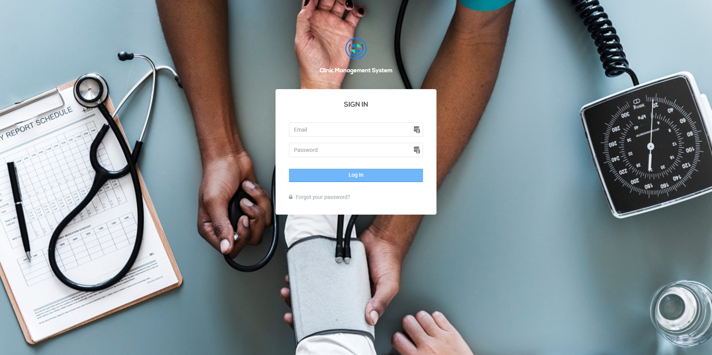
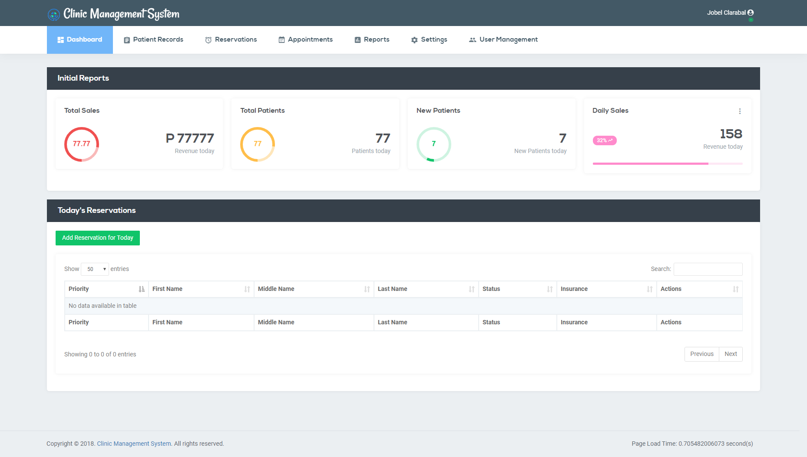

#### Clinicharts

This was built last 2018 using Laravel framework for a Pedia Clinic here in our local community.

I know this is not the best implementation but can be improved. This system is still running and used in the clinic.

##### How to use:

1. composer update
2. Rename file .env.example to .env and Edir DB configurations
2. php artisan migrate
3. php artisan db:seed (for the initial Admin user login info)

u: admin@admin.com / p: Admin!123

